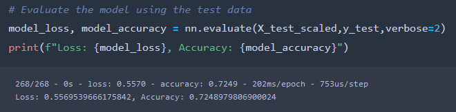
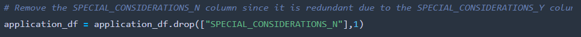
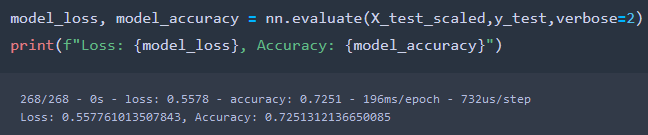
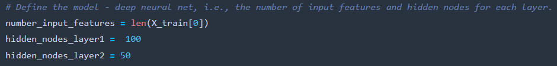
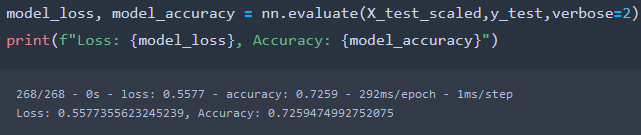
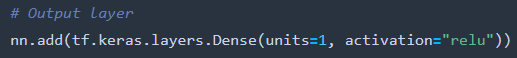
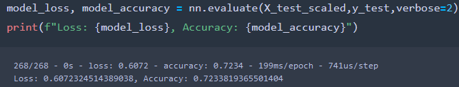

# # Neural_Network_Charity_Analysis

## Overview of the Analysis
### Purpose
The purpose of this analysis is to create a binary classifier that is capable of predicting whether applicants will be successful if funded by Alphabet Soup.

## Results 

 - *Data Preprocessing*
	 - The target variable for the model is the IS_SUCCESSFUL column
	 - The features for the model are all the columns except the aforementioned column and the columns that will be dropped
	 - The variables that were neither targets or features for the dataset are the columns that were dropped. Specifically the EIN, NAME, and SPECIAL_CONSIDERATIONS_N (a one hot encoded column removed during optimization attempts) columns
 - *Compiling, Training, and Evaluating the Model*
	 - In the model there were 2 hidden layers and 1 output layer. The hidden layers had 80 nodes in the first and 30 in the second. They both used the same activation function, relu. The output layer used the sigmoid activation function.
	 - There was a target performance of 75% accuracy. The model only reached 72.5% accuracy.
	
	- I attempted 3 times to improve the accuracy of the model. The changes in my attempts were cumulative.
		- I first removed the SPECIAL_CONSIDERATIONS_N column since it is made redundant by the SPECIAL_CONSIDERATIONS_Y column. This resulted in little to no change in the accuracy.
		
	    
	    - Next I added more nodes to the hidden layers. Again though, this resulted in little to no change to the accuracy.
		
	    
	    - Finally, I changed the activation function in the output layer from sigmoid to relu as well. Again, there was little to no change in the accuracy.
 		
	    

## Summary
Overall, the attempts at optimization failed as the accuracy remained roughly the same. It's possible the accuracy remained so low due to the fact that the model was overfitting. To combat overfitting, we could instead use a random forest model since they are less prone to overfitting.
